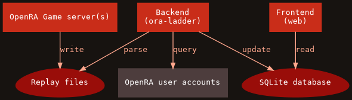

# OpenRA ladder

This repository contains all the sources used by the OpenRA community
competitive 1v1 ladder hosted on [oraladder.net](http://oraladder.net).

It contains:
- the web frontend written in Flask (Python)
- the backend tools (`ora-ladder`, `ora-replay`)
- the game server configuration
- detailed explanations on the setup
- a work-in-progress RAGL integration

For some context and history on the project, you can also read the following
blog post: [Building a competitive ladder for OpenRA][blog-post].

[blog-post]: http://blog.pkh.me/p/28-building-a-competitive-ladder-for-openra.html


## Developers

### Bootstrap

The only dependency is `Python`. To run the ladder locally, just type `make`.
This will create a local Python virtualenv, bootstrap all the dependencies into
it, and start a local development server.

The site should be accessible through http://127.0.0.1:5000 and any change in
the sources will be reflected there immediately.

Initially the database is empty so what's being displayed has little to no
interest. We can fill it using the `ora-ladder` backend command:

```sh
# Enter the virtualenv
. venv/bin/activate

# Create the 2 databases (all times and periodic) with your local RA replays
ora-ladder -d db-ra-all.sqlite3 ~/.config/openra/Replays/ra
ora-ladder -d db-ra-2m.sqlite3 -p 2m ~/.config/openra/Replays/ra

# If everything went well, update the DB of the website atomically
cp db-ra-all.sqlite3 db-ra-2m.sqlite3 instance/
```


## Architecture

The general architecture used on oraladder.net is pretty simple:



The game server instances are configured to record the replays. Then on a
regular basis, the backend parses them to find the outcomes, identify the
players, and finally update their rank.  During the process of ranking, the
backend also has to query the OpenRA user accounts API (external) to identify
the players and obtain more information (the display name typically). Finally,
the web frontend is just a dumb way of displaying the information contained in
the database.

Each brick can technically be separated. For example, game servers can be on
other machines, and replay files synchronized for the backend to read. This
means adding matches from other sources is just about synchronizing files.
Similarly, the website could be hosted elsewhere (even thought it might not
make much sense). This also means the backend could easily be adjusted to craft
the data in another form for a different frontend.

Another handy aspect of this approach is that an admin doesn't need any special
interface for maintainance: only the replays have to be managed. They can be
arbitrarily organized into folders since the backend searches through all the
configured paths. To remove a match, (re)moving the file and make sure the DB
is reset is enough.

Last but not least, since the replays contain pretty much all information about
the matches, additional statistics and analysis could be added in the future.


## Production infrastructure

In production, the setup requires a bit more work than in development mode.
Following is a suggestion of setup.

Let's assume we have 2 users: `ora` and `web`. `ora` is running the game
server, and `web` runs the backend script and the web frontend (this could be
split further but let's keep it simple for now):

```sh
useradd -m ora
useradd -m web

# allow the web to read the replays
usermod -a -G ora web
chmod g+rx /home/ora
```

### Game server instances

`ora` needs a virtualenv with the ladder installed in it. For that, we need to
build a Python `wheel` of `oraladder`. This can be done with `make wheel`.  It
will create an `oraladder-*-py3-none-any.whl` file. After uploading it into
`ora` home directory, we can setup the game server instances:

```sh
# Setup virtualenv
python -m venv venv

# Enter the virtualenv
. venv/bin/activate

# Install the ladder wheel
pip install oraladder-*-py3-none-any.whl
```

The game server instances need a map pool. Map pool examples can be found in
`misc/map-pools/`.

`ora-srvwrap` (available in the venv) is a helper to bootstrap (if needed) and
run the game server with competitive settings. This tool does a lot of
things:
1. it fetches the OpenRA sources (if needed) at the specified version and build
   them
2. it creates an isolated game server instance directory in which these sources
   are copied
3. it patches the specified mod with locked competitive settings
4. it downloads all the maps of the map pool if not available in its cache
5. it drops all the internal maps and replace them with the previously
   downloaded map pool
6. it finally runs the game server instance on a port derived from the
   specified argument

Assuming `misc/map-pools` was uploaded in the home directory, here is an
example for running 3 game server instances:

```sh
ora-srvwrap map-pools/ladder.maps --label 'My Competitive 1v1 Ladder Server {id}' --baseport 10100 --basewkdir srv-ladder --instance-id 0
ora-srvwrap map-pools/ladder.maps --label 'My Competitive 1v1 Ladder Server {id}' --baseport 10100 --basewkdir srv-ladder --instance-id 1
ora-srvwrap map-pools/ladder.maps --label 'My Competitive 1v1 Ladder Server {id}' --baseport 10100 --basewkdir srv-ladder --instance-id 2
```

**Note**: a different shell will be required for each since this is not running
in background.

A `motd` template file can also be specified with `--motd-file`. See
`ora-srvwrap --help` for more information.

With our previous example, each instance will have their replays recording
stored into `~/srv-ladder/instance-*/support_dir/Replays`.


### Backend

Just like `ora`, `web` needs a virtualenv with the ladder installed in it. Upload
`oraladder-*-py3-none-any.whl` again, this time in `web` home directory. Then
we can setup the ladder:

```sh
# Setup virtualenv
python -m venv venv

# Enter the virtualenv
. venv/bin/activate

# Install the ladder wheel
pip install oraladder-*-py3-none-any.whl

# Create initial empty databases
mkdir -p venv/var/ladderweb-instance
ora-ladder -d venv/var/ladderweb-instance/db-ra-all.sqlite3  # all-time DB
ora-ladder -d venv/var/ladderweb-instance/db-ra-2m.sqlite3 -p 2m  # periodic DB

# Create a useful DB update script
cat <<EOF > ~/update-ladderdb.sh
#!/bin/sh
set -xeu
~/venv/bin/ora-ladder -d db-ra-all.sqlite3      /home/ora/srv-ladder/instance-*/support_dir/Replays/
~/venv/bin/ora-ladder -d db-ra-2m.sqlite3 -p 2m /home/ora/srv-ladder/instance-*/support_dir/Replays/
cp db-ra-all.sqlite3 db-ra-2m.sqlite3 /home/web/venv/var/ladderweb-instance
EOF
chmod +x ~/update-ladderdb.sh
```

The last step is to setup a crontab to update the database regularly; in
`crontab -e` we can for example do:
```
*/5 * * * * ~/update-ladderdb.sh
0   0 * * * rm -f ~/db-*.sqlite3
```

This will update the database every 5 minutes. And every day, we remove the
cached `db-ra-all.sqlite3` (and `db-ra-2m.sqlite3`) so that the next update
causes a full reconstruction of the databases. This is an arbitrary trade-off
to avoid spamming OpenRA user account service, and still get relatively
up-to-date information displayed.


### Frontend

The front-end is the last step. So as `web` user:

```sh
# Re-enter the virtualenv (if not already in)
. venv/bin/activate

# Install Green Unicorn (Python WSGI HTTP Server)
pip install gunicorn

# Generate a secret key
# Following https://flask.palletsprojects.com/en/1.1.x/tutorial/deploy/#configure-the-secret-key
python -c 'import os;print(f"SECRET_KEY = {repr(os.urandom(16))}")' > ~/venv/var/ladderweb-instance/config.py

# Start the service (listening on 127.0.0.1:8000)
gunicorn ladderweb:app
```

Now that the server is listening in local, we can use `nginx` to expose it to
the outside. A `nginx.conf` configuration example file is available in the
`misc` directory.

Since the outcomes are stored in UTC time in the replays, you will likely want
to align the system clock as well so that the website behaves in coordination
(typically with regards to period resets) using for example `timedatectl
set-timezone Etc/UTC`.
